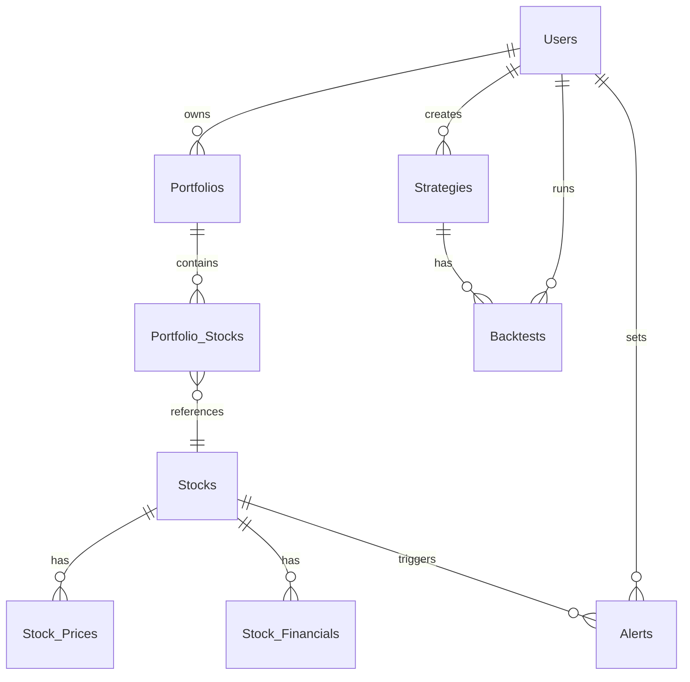

# Database Schema
*Cập nhật lần cuối: 2024-04-18*

## Tổng quan
Database của Stock Analysis & Backtesting Platform sử dụng MySQL 8.0, được thiết kế để lưu trữ dữ liệu người dùng, danh mục đầu tư, chiến lược giao dịch, và dữ liệu thị trường.

## Cấu trúc Bảng

### 1. Users
Bảng lưu trữ thông tin người dùng.

| Cột | Kiểu dữ liệu | Ràng buộc | Mô tả |
|-----|-------------|-----------|-------|
| id | INT | PK, AUTO_INCREMENT | ID người dùng |
| username | VARCHAR(50) | UNIQUE, NOT NULL | Tên đăng nhập |
| email | VARCHAR(100) | UNIQUE, NOT NULL | Email |
| hashed_password | VARCHAR(255) | NOT NULL | Mật khẩu đã mã hóa |
| full_name | VARCHAR(100) | | Họ tên đầy đủ |
| is_active | BOOLEAN | DEFAULT TRUE | Trạng thái tài khoản |
| is_superuser | BOOLEAN | DEFAULT FALSE | Quyền admin |
| created_at | TIMESTAMP | DEFAULT CURRENT_TIMESTAMP | Thời gian tạo |
| updated_at | TIMESTAMP | DEFAULT CURRENT_TIMESTAMP ON UPDATE CURRENT_TIMESTAMP | Thời gian cập nhật |

**Indexes:**
- PRIMARY KEY (id)
- UNIQUE INDEX idx_username (username)
- UNIQUE INDEX idx_email (email)
- INDEX idx_is_active (is_active)

### 2. Portfolios
Bảng lưu trữ danh mục đầu tư của người dùng.

| Cột | Kiểu dữ liệu | Ràng buộc | Mô tả |
|-----|-------------|-----------|-------|
| id | INT | PK, AUTO_INCREMENT | ID danh mục |
| user_id | INT | FK, NOT NULL | ID người dùng sở hữu |
| name | VARCHAR(100) | NOT NULL | Tên danh mục |
| description | TEXT | | Mô tả danh mục |
| is_public | BOOLEAN | DEFAULT FALSE | Công khai hay riêng tư |
| created_at | TIMESTAMP | DEFAULT CURRENT_TIMESTAMP | Thời gian tạo |
| updated_at | TIMESTAMP | DEFAULT CURRENT_TIMESTAMP ON UPDATE CURRENT_TIMESTAMP | Thời gian cập nhật |

**Indexes:**
- PRIMARY KEY (id)
- INDEX idx_user_id (user_id)
- INDEX idx_is_public (is_public)

**Foreign Keys:**
- FOREIGN KEY (user_id) REFERENCES Users(id) ON DELETE CASCADE

### 3. Stocks
Bảng lưu trữ thông tin cổ phiếu.

| Cột | Kiểu dữ liệu | Ràng buộc | Mô tả |
|-----|-------------|-----------|-------|
| id | INT | PK, AUTO_INCREMENT | ID cổ phiếu |
| symbol | VARCHAR(10) | UNIQUE, NOT NULL | Mã cổ phiếu |
| name | VARCHAR(100) | NOT NULL | Tên công ty |
| sector | VARCHAR(50) | | Ngành nghề |
| industry | VARCHAR(50) | | Lĩnh vực |
| market_cap | DECIMAL(20,2) | | Vốn hóa thị trường |
| last_updated | TIMESTAMP | DEFAULT CURRENT_TIMESTAMP ON UPDATE CURRENT_TIMESTAMP | Thời gian cập nhật cuối |

**Indexes:**
- PRIMARY KEY (id)
- UNIQUE INDEX idx_symbol (symbol)
- INDEX idx_sector (sector)
- INDEX idx_industry (industry)

### 4. Portfolio_Stocks
Bảng liên kết giữa danh mục và cổ phiếu.

| Cột | Kiểu dữ liệu | Ràng buộc | Mô tả |
|-----|-------------|-----------|-------|
| portfolio_id | INT | PK, FK, NOT NULL | ID danh mục |
| stock_id | INT | PK, FK, NOT NULL | ID cổ phiếu |
| quantity | INT | DEFAULT 0 | Số lượng cổ phiếu |
| avg_price | DECIMAL(10,2) | | Giá trung bình mua |
| added_at | TIMESTAMP | DEFAULT CURRENT_TIMESTAMP | Thời gian thêm vào |

**Indexes:**
- PRIMARY KEY (portfolio_id, stock_id)
- INDEX idx_stock_id (stock_id)

**Foreign Keys:**
- FOREIGN KEY (portfolio_id) REFERENCES Portfolios(id) ON DELETE CASCADE
- FOREIGN KEY (stock_id) REFERENCES Stocks(id) ON DELETE CASCADE

### 5. Strategies
Bảng lưu trữ chiến lược giao dịch.

| Cột | Kiểu dữ liệu | Ràng buộc | Mô tả |
|-----|-------------|-----------|-------|
| id | INT | PK, AUTO_INCREMENT | ID chiến lược |
| user_id | INT | FK, NOT NULL | ID người dùng sở hữu |
| name | VARCHAR(100) | NOT NULL | Tên chiến lược |
| description | TEXT | | Mô tả chiến lược |
| type | ENUM('TECHNICAL', 'FUNDAMENTAL', 'HYBRID') | NOT NULL | Loại chiến lược |
| parameters | JSON | | Tham số chiến lược |
| is_public | BOOLEAN | DEFAULT FALSE | Công khai hay riêng tư |
| created_at | TIMESTAMP | DEFAULT CURRENT_TIMESTAMP | Thời gian tạo |
| updated_at | TIMESTAMP | DEFAULT CURRENT_TIMESTAMP ON UPDATE CURRENT_TIMESTAMP | Thời gian cập nhật |

**Indexes:**
- PRIMARY KEY (id)
- INDEX idx_user_id (user_id)
- INDEX idx_type (type)
- INDEX idx_is_public (is_public)

**Foreign Keys:**
- FOREIGN KEY (user_id) REFERENCES Users(id) ON DELETE CASCADE

### 6. Backtests
Bảng lưu trữ kết quả backtest.

| Cột | Kiểu dữ liệu | Ràng buộc | Mô tả |
|-----|-------------|-----------|-------|
| id | INT | PK, AUTO_INCREMENT | ID backtest |
| strategy_id | INT | FK, NOT NULL | ID chiến lược |
| user_id | INT | FK, NOT NULL | ID người dùng thực hiện |
| start_date | DATE | NOT NULL | Ngày bắt đầu |
| end_date | DATE | NOT NULL | Ngày kết thúc |
| initial_capital | DECIMAL(20,2) | NOT NULL | Vốn ban đầu |
| final_capital | DECIMAL(20,2) | | Vốn cuối cùng |
| total_return | DECIMAL(10,2) | | Tổng lợi nhuận (%) |
| max_drawdown | DECIMAL(10,2) | | Drawdown tối đa (%) |
| sharpe_ratio | DECIMAL(10,4) | | Hệ số Sharpe |
| parameters | JSON | | Tham số backtest |
| results | JSON | | Kết quả chi tiết |
| created_at | TIMESTAMP | DEFAULT CURRENT_TIMESTAMP | Thời gian tạo |

**Indexes:**
- PRIMARY KEY (id)
- INDEX idx_strategy_id (strategy_id)
- INDEX idx_user_id (user_id)
- INDEX idx_start_date (start_date)
- INDEX idx_end_date (end_date)

**Foreign Keys:**
- FOREIGN KEY (strategy_id) REFERENCES Strategies(id) ON DELETE CASCADE
- FOREIGN KEY (user_id) REFERENCES Users(id) ON DELETE CASCADE

### 7. Alerts
Bảng lưu trữ cảnh báo cho người dùng.

| Cột | Kiểu dữ liệu | Ràng buộc | Mô tả |
|-----|-------------|-----------|-------|
| id | INT | PK, AUTO_INCREMENT | ID cảnh báo |
| user_id | INT | FK, NOT NULL | ID người dùng |
| stock_id | INT | FK, NOT NULL | ID cổ phiếu |
| type | ENUM('PRICE', 'VOLUME', 'TECHNICAL', 'FUNDAMENTAL') | NOT NULL | Loại cảnh báo |
| condition | JSON | NOT NULL | Điều kiện cảnh báo |
| is_active | BOOLEAN | DEFAULT TRUE | Trạng thái cảnh báo |
| last_triggered | TIMESTAMP | NULL | Thời gian kích hoạt cuối |
| created_at | TIMESTAMP | DEFAULT CURRENT_TIMESTAMP | Thời gian tạo |
| updated_at | TIMESTAMP | DEFAULT CURRENT_TIMESTAMP ON UPDATE CURRENT_TIMESTAMP | Thời gian cập nhật |

**Indexes:**
- PRIMARY KEY (id)
- INDEX idx_user_id (user_id)
- INDEX idx_stock_id (stock_id)
- INDEX idx_type (type)
- INDEX idx_is_active (is_active)

**Foreign Keys:**
- FOREIGN KEY (user_id) REFERENCES Users(id) ON DELETE CASCADE
- FOREIGN KEY (stock_id) REFERENCES Stocks(id) ON DELETE CASCADE

### 8. Stock_Prices
Bảng lưu trữ dữ liệu giá cổ phiếu.

| Cột | Kiểu dữ liệu | Ràng buộc | Mô tả |
|-----|-------------|-----------|-------|
| id | INT | PK, AUTO_INCREMENT | ID bản ghi |
| stock_id | INT | FK, NOT NULL | ID cổ phiếu |
| date | DATE | NOT NULL | Ngày giao dịch |
| open | DECIMAL(10,2) | NOT NULL | Giá mở cửa |
| high | DECIMAL(10,2) | NOT NULL | Giá cao nhất |
| low | DECIMAL(10,2) | NOT NULL | Giá thấp nhất |
| close | DECIMAL(10,2) | NOT NULL | Giá đóng cửa |
| volume | BIGINT | NOT NULL | Khối lượng giao dịch |
| created_at | TIMESTAMP | DEFAULT CURRENT_TIMESTAMP | Thời gian tạo |

**Indexes:**
- PRIMARY KEY (id)
- UNIQUE INDEX idx_stock_date (stock_id, date)
- INDEX idx_date (date)

**Foreign Keys:**
- FOREIGN KEY (stock_id) REFERENCES Stocks(id) ON DELETE CASCADE

### 9. Stock_Financials
Bảng lưu trữ dữ liệu tài chính của cổ phiếu.

| Cột | Kiểu dữ liệu | Ràng buộc | Mô tả |
|-----|-------------|-----------|-------|
| id | INT | PK, AUTO_INCREMENT | ID bản ghi |
| stock_id | INT | FK, NOT NULL | ID cổ phiếu |
| year | INT | NOT NULL | Năm tài chính |
| quarter | INT | NOT NULL | Quý tài chính |
| revenue | DECIMAL(20,2) | | Doanh thu |
| profit | DECIMAL(20,2) | | Lợi nhuận |
| eps | DECIMAL(10,2) | | EPS |
| pe_ratio | DECIMAL(10,2) | | P/E ratio |
| pb_ratio | DECIMAL(10,2) | | P/B ratio |
| data | JSON | | Dữ liệu tài chính chi tiết |
| created_at | TIMESTAMP | DEFAULT CURRENT_TIMESTAMP | Thời gian tạo |
| updated_at | TIMESTAMP | DEFAULT CURRENT_TIMESTAMP ON UPDATE CURRENT_TIMESTAMP | Thời gian cập nhật |

**Indexes:**
- PRIMARY KEY (id)
- UNIQUE INDEX idx_stock_year_quarter (stock_id, year, quarter)
- INDEX idx_year (year)
- INDEX idx_quarter (quarter)

**Foreign Keys:**
- FOREIGN KEY (stock_id) REFERENCES Stocks(id) ON DELETE CASCADE

## Views

### 1. vw_portfolio_summary
View tổng hợp thông tin danh mục đầu tư.

```sql
CREATE VIEW vw_portfolio_summary AS
SELECT 
    p.id AS portfolio_id,
    p.name AS portfolio_name,
    u.username AS owner,
    COUNT(ps.stock_id) AS stock_count,
    SUM(ps.quantity * ps.avg_price) AS total_value
FROM 
    Portfolios p
JOIN 
    Users u ON p.user_id = u.id
LEFT JOIN 
    Portfolio_Stocks ps ON p.id = ps.portfolio_id
GROUP BY 
    p.id, p.name, u.username;
```

### 2. vw_stock_performance
View tổng hợp hiệu suất cổ phiếu.

```sql
CREATE VIEW vw_stock_performance AS
SELECT 
    s.id AS stock_id,
    s.symbol,
    s.name,
    sp.date,
    sp.close,
    sp.volume,
    (sp.close - LAG(sp.close) OVER (PARTITION BY s.id ORDER BY sp.date)) / LAG(sp.close) OVER (PARTITION BY s.id ORDER BY sp.date) * 100 AS daily_return
FROM 
    Stocks s
JOIN 
    Stock_Prices sp ON s.id = sp.stock_id;
```

## Stored Procedures

### 1. sp_update_stock_prices
Procedure cập nhật dữ liệu giá cổ phiếu.

```sql
DELIMITER //
CREATE PROCEDURE sp_update_stock_prices(IN p_symbol VARCHAR(10), IN p_date DATE, IN p_open DECIMAL(10,2), IN p_high DECIMAL(10,2), IN p_low DECIMAL(10,2), IN p_close DECIMAL(10,2), IN p_volume BIGINT)
BEGIN
    DECLARE v_stock_id INT;
    
    -- Lấy stock_id từ symbol
    SELECT id INTO v_stock_id FROM Stocks WHERE symbol = p_symbol;
    
    -- Nếu không tìm thấy, tạo mới
    IF v_stock_id IS NULL THEN
        INSERT INTO Stocks (symbol, name) VALUES (p_symbol, p_symbol);
        SET v_stock_id = LAST_INSERT_ID();
    END IF;
    
    -- Cập nhật hoặc thêm mới dữ liệu giá
    INSERT INTO Stock_Prices (stock_id, date, open, high, low, close, volume)
    VALUES (v_stock_id, p_date, p_open, p_high, p_low, p_close, p_volume)
    ON DUPLICATE KEY UPDATE
        open = p_open,
        high = p_high,
        low = p_low,
        close = p_close,
        volume = p_volume;
END //
DELIMITER ;
```

### 2. sp_calculate_portfolio_value
Procedure tính toán giá trị danh mục đầu tư.

```sql
DELIMITER //
CREATE PROCEDURE sp_calculate_portfolio_value(IN p_portfolio_id INT)
BEGIN
    DECLARE v_total_value DECIMAL(20,2);
    
    -- Tính tổng giá trị danh mục
    SELECT SUM(ps.quantity * sp.close) INTO v_total_value
    FROM Portfolio_Stocks ps
    JOIN Stocks s ON ps.stock_id = s.id
    JOIN Stock_Prices sp ON s.id = sp.stock_id
    WHERE ps.portfolio_id = p_portfolio_id
    AND sp.date = (SELECT MAX(date) FROM Stock_Prices WHERE stock_id = s.id);
    
    -- Trả về kết quả
    SELECT p.id, p.name, v_total_value AS total_value
    FROM Portfolios p
    WHERE p.id = p_portfolio_id;
END //
DELIMITER ;
```

## Triggers

### 1. trg_update_stock_last_updated
Trigger cập nhật thời gian cập nhật cuối của cổ phiếu.

```sql
DELIMITER //
CREATE TRIGGER trg_update_stock_last_updated
AFTER INSERT ON Stock_Prices
FOR EACH ROW
BEGIN
    UPDATE Stocks SET last_updated = NOW() WHERE id = NEW.stock_id;
END //
DELIMITER ;
```

## Quan hệ giữa các bảng



## Ghi chú
- Tất cả các bảng đều có timestamp cho việc theo dõi thời gian tạo và cập nhật
- Sử dụng JSON để lưu trữ dữ liệu có cấu trúc phức tạp
- Các khóa ngoại đều có ON DELETE CASCADE để đảm bảo tính toàn vẹn dữ liệu
- Indexes được tạo cho các trường thường xuyên được tìm kiếm 