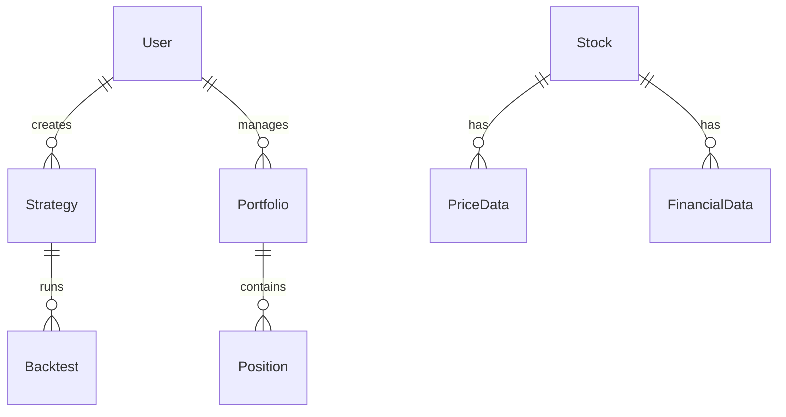

# Tổng quan Dự án: Stock Analysis & Backtesting Platform
*Cập nhật lần cuối: 2024-03-19*
*AI LƯU Ý: Luôn tham khảo file này để hiểu bối cảnh tổng thể.*

## 1. Mục tiêu & Bối cảnh Kinh doanh
*(Tại sao dự án tồn tại? Giải quyết vấn đề gì?)*

### 1.1 Mục tiêu
- Xây dựng nền tảng phân tích và backtest chiến lược đầu tư chứng khoán Việt Nam
- Cung cấp công cụ phân tích kỹ thuật và cơ bản cho nhà đầu tư
- Hỗ trợ backtest và tối ưu hóa chiến lược giao dịch
- Tích hợp dữ liệu thời gian thực và lịch sử từ nhiều nguồn

### 1.2 Giá trị mang lại
- Giúp nhà đầu tư đánh giá hiệu quả chiến lược trước khi áp dụng thực tế
- Cung cấp công cụ phân tích chuyên sâu, dễ sử dụng
- Tối ưu hóa quyết định đầu tư dựa trên dữ liệu
- Giảm thiểu rủi ro khi thử nghiệm chiến lược mới

## 2. Ngăn xếp Công nghệ (Tech Stack) - **QUAN TRỌNG**

### 2.1 Backend
- **Ngôn ngữ**: Python 3.11
- **Framework**: FastAPI
- **Database**:
  - MySQL 8.0 (dữ liệu quan hệ)
  - File-based cache (thay vì Redis)
- **ORM**: SQLAlchemy 2.0
- **API Documentation**: Swagger/OpenAPI
- **Authentication**: JWT + OAuth2

### 2.2 Frontend
- **Framework**: Next.js 14
- **UI Library**: Material-UI (MUI)
- **State Management**: Redux Toolkit
- **Charting**: TradingView Lightweight Charts
- **Data Visualization**: Plotly.js
- **Form Handling**: React Hook Form
- **Validation**: Zod

### 2.3 Data Processing & Analysis
- **Data Collection**: vnstock 3.2.0
- **Data Processing**: pandas, numpy
- **Technical Analysis**: ta-lib
- **Machine Learning**: scikit-learn, tensorflow
- **Backtesting**: backtrader
- **Optimization**: optuna

### 2.4 DevOps & Infrastructure
- **Database Management**: PHPMyAdmin
- **Version Control**: Git
- **CI/CD**: GitHub Actions (tùy chọn)
- **Logging**: File-based logging
- **Cloud**: Shared hosting compatible

## 3. Kiến trúc Tổng thể & Patterns Chính

### 3.1 Kiến trúc Monolithic
```
┌─────────────────┐
│  Frontend (Next.js)  │
└────────┬────────┘
         │
         ▼
┌─────────────────┐
│  Backend (FastAPI)  │
└────────┬────────┘
         │
         ▼
┌─────────────────┐
│  Database (MySQL)  │
└─────────────────┘
```

### 3.2 Patterns Chính
- **Repository Pattern**: Quản lý truy cập dữ liệu
- **Factory Pattern**: Tạo đối tượng chiến lược
- **Strategy Pattern**: Triển khai các chiến lược giao dịch
- **Observer Pattern**: Theo dõi thay đổi thị trường

## 4. Cấu trúc Thư mục Dự án
```
stock-platform/
├── backend/
│   ├── api/                 # API endpoints
│   ├── core/               # Core business logic
│   ├── models/             # Database models
│   ├── services/           # Business services
│   ├── strategies/         # Trading strategies
│   └── utils/              # Utility functions
├── frontend/
│   ├── components/         # React components
│   ├── pages/             # Next.js pages
│   ├── store/             # Redux store
│   ├── hooks/             # Custom hooks
│   └── styles/            # CSS/SCSS
├── data/
│   ├── raw/               # Raw data
│   ├── processed/         # Processed data
│   └── cache/            # Cached data
└── tests/                 # Test files
```

## 5. Domain Model / Khái niệm Cốt lõi

### 5.1 Các Entity Chính


### 5.2 Các Khái niệm Quan trọng
- **User**: Nhà đầu tư sử dụng hệ thống
- **Strategy**: Chiến lược giao dịch
- **Portfolio**: Danh mục đầu tư
- **Stock**: Cổ phiếu
- **PriceData**: Dữ liệu giá
- **FinancialData**: Dữ liệu tài chính
- **Backtest**: Kết quả backtest
- **Position**: Vị thế giao dịch

## 6. Thư viện Quan trọng & Lưu ý Sử dụng

### 6.1 Backend
- **FastAPI**: Xây dựng API nhanh, hiệu quả
- **SQLAlchemy**: ORM mạnh mẽ, hỗ trợ MySQL
- **JWT**: Quản lý xác thực
- **backtrader**: Backtesting engine

### 6.2 Frontend
- **Next.js**: SSR, routing, API routes
- **MUI**: Component library
- **Redux Toolkit**: State management
- **TradingView Charts**: Hiển thị biểu đồ
- **Plotly.js**: Visualization phức tạp

### 6.3 Data Processing
- **vnstock**: Lấy dữ liệu thị trường
- **pandas**: Xử lý dữ liệu
- **ta-lib**: Phân tích kỹ thuật
- **scikit-learn**: Machine learning
- **optuna**: Tối ưu hóa tham số

## 7. Các Luồng (Flows) Chính

### 7.1 Luồng Backtest
1. Người dùng chọn/tạo chiến lược
2. Cấu hình tham số backtest
3. Chạy backtest
4. Xem kết quả và phân tích
5. Tối ưu hóa tham số
6. Lưu chiến lược

### 7.2 Luồng Phân tích
1. Chọn cổ phiếu/cụm cổ phiếu
2. Chọn chỉ báo/phương pháp phân tích
3. Xem kết quả phân tích
4. Xuất báo cáo

### 7.3 Luồng Theo dõi
1. Tạo danh mục theo dõi
2. Cấu hình cảnh báo
3. Nhận thông báo
4. Phân tích hiệu suất

## 8. Thiết lập Môi trường & Bắt đầu

### 8.1 Yêu cầu Hệ thống
- Python 3.11+
- Node.js 18+
- MySQL 8.0+
- PHPMyAdmin (tùy chọn)

### 8.2 Cài đặt
```bash
# Clone repository
git clone https://github.com/your-org/stock-platform.git
cd stock-platform

# Backend setup
python -m venv venv
source venv/bin/activate  # hoặc .\venv\Scripts\activate trên Windows
pip install -r requirements.txt

# Frontend setup
cd frontend
npm install

# Database setup
# 1. Tạo database trong MySQL
# 2. Cập nhật thông tin kết nối trong backend/.env
# 3. Chạy migrations
cd ../backend
alembic upgrade head

# Run development servers
# Terminal 1: Backend
uvicorn main:app --reload --host 0.0.0.0 --port 8000

# Terminal 2: Frontend
cd ../frontend
npm run dev
```

## 9. Liên kết Nhanh
- [API Documentation](docs/api.md)
- [Database Schema](docs/database_schema.md)
- [Testing Guidelines](docs/testing.md)
- [Deployment Guide](docs/deployment.md)
- [Contributing Guide](docs/contributing.md) 