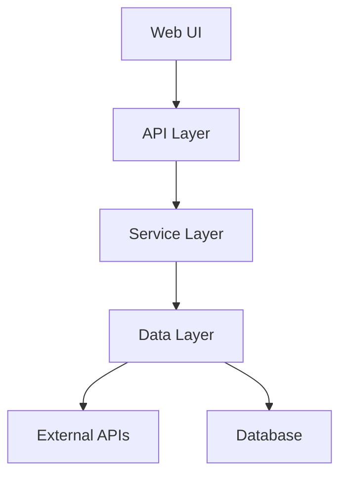
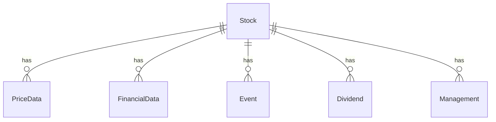

# Tổng quan Dự án: Vietnam Stock Platform
*Cập nhật lần cuối: 2024-04-20*
*AI LƯU Ý: Luôn tham khảo file này để hiểu bối cảnh tổng thể.*

## 1. Mục tiêu & Bối cảnh Kinh doanh
- Xây dựng nền tảng phân tích và theo dõi cổ phiếu Việt Nam
- Cung cấp dữ liệu thị trường chứng khoán theo thời gian thực
- Hỗ trợ nhà đầu tư đưa ra quyết định đầu tư thông minh
- Tích hợp các công cụ phân tích kỹ thuật và cơ bản

## 2. Ngăn xếp Công nghệ (Tech Stack) - **QUAN TRỌNG**
### Backend
- Python 3.12
- FastAPI 0.110.0
- SQLAlchemy 2.0
- PostgreSQL 16
- vnstock (thư viện lấy dữ liệu chứng khoán)
- Poetry (dependency management)

### Frontend  
- React 18
- TypeScript 5
- Vite
- TailwindCSS
- React Query
- React Router

## 3. Kiến trúc Tổng thể & Patterns Chính
- Clean Architecture
- Repository Pattern
- CQRS (Command Query Responsibility Segregation)


## 4. Cấu trúc Thư mục Dự án
```
vietnam-stock/
├── backend/                      # Backend FastAPI application
│   ├── app/                     # Application code
│   │   ├── api/                # API endpoints
│   │   │   ├── v1/            # API version 1
│   │   │   └── v2/            # API version 2 (future)
│   │   ├── core/               # Core functionality
│   │   │   ├── config/        # Configuration
│   │   │   ├── security/      # Authentication & Authorization
│   │   │   └── utils/         # Utility functions
│   │   ├── models/            # Database models
│   │   ├── schemas/           # Pydantic schemas
│   │   └── services/          # Business logic
│   ├── tests/                  # Test files
│   │   ├── unit/              # Unit tests
│   │   ├── integration/       # Integration tests
│   │   └── e2e/               # End-to-end tests
│   ├── docs/                  # API documentation
│   ├── scripts/               # Utility scripts
│   ├── alembic/              # Database migrations
│   └── docker/               # Docker configuration
├── frontend/                    # React frontend application
│   ├── src/                   # Source code
│   │   ├── components/        # React components
│   │   │   ├── common/       # Shared components
│   │   │   ├── layout/       # Layout components
│   │   │   └── features/     # Feature-specific components
│   │   ├── pages/            # Page components
│   │   ├── hooks/            # Custom hooks
│   │   ├── services/         # API services
│   │   ├── store/            # State management
│   │   ├── types/            # TypeScript types
│   │   └── utils/            # Utility functions
│   ├── tests/                # Test files
│   │   ├── unit/            # Unit tests
│   │   ├── integration/     # Integration tests
│   │   └── e2e/             # End-to-end tests
│   └── public/              # Static assets
├── docs/                       # Project documentation
│   ├── api/                  # API documentation
│   ├── architecture/         # Architecture docs
│   ├── deployment/          # Deployment guides
│   └── development/         # Development guides
├── infrastructure/            # Infrastructure as Code
│   ├── terraform/           # Terraform configurations
│   └── kubernetes/          # Kubernetes configurations
├── scripts/                   # Project-wide scripts
│   ├── setup/               # Setup scripts
│   ├── deployment/          # Deployment scripts
│   └── maintenance/         # Maintenance scripts
└── docker-compose.yml        # Docker Compose configuration
```

## 5. Domain Model / Khái niệm Cốt lõi


## 6. Thư viện Quan trọng & Lưu ý Sử dụng
### Backend
- FastAPI: Framework API chính
- vnstock: Thư viện lấy dữ liệu chứng khoán
- SQLAlchemy: ORM cho database
- Alembic: Quản lý migrations
- Poetry: Quản lý dependencies

### Frontend
- React Query: State management và data fetching
- TailwindCSS: Styling
- React Router: Routing

## 7. Các Luồng (Flows) Chính
1. Quản lý Dữ liệu Cổ phiếu
   - Lấy danh sách cổ phiếu
   - Lấy dữ liệu giá theo thời gian
   - Lấy thông tin tài chính
   - Lấy thông tin sự kiện

2. Phân tích Cổ phiếu
   - Sàng lọc cổ phiếu theo tiêu chí
   - Phân tích kỹ thuật
   - Phân tích cơ bản
   - Theo dõi danh mục đầu tư

## 8. Thiết lập Môi trường & Bắt đầu (Getting Started)
### Backend
```bash
# Activate virtual environment
source venv/bin/activate  # Linux/Mac
.\venv\Scripts\activate   # Windows

# Install dependencies
poetry install

# Run migrations
alembic upgrade head

# Start development server
uvicorn app.main:app --reload
```

### Frontend
```bash
# Install dependencies
npm install

# Start development server
npm run dev
```

## 9. Liên kết Nhanh (Quick Links)
- [Database Schema](./database_schema.md)
- [Tasks](./tasks.md)
- [API Documentation](./docs/api.md)
- [Testing Guide](./docs/testing.md)
- [Coding Conventions](./docs/conventions.md)